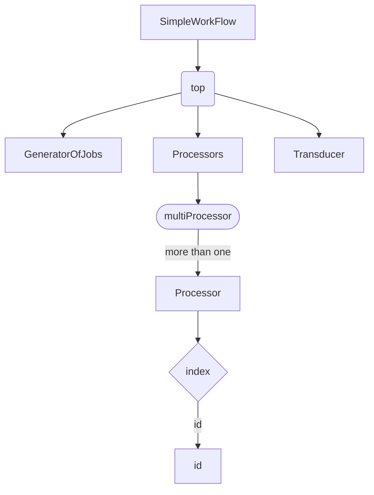
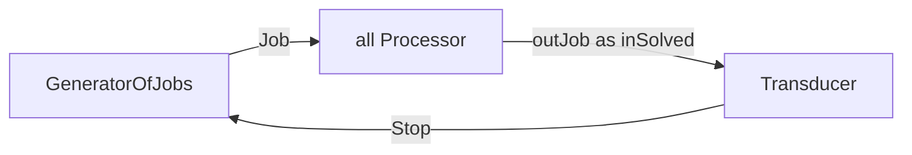

# SimpleWorkFlow — SES Hierarchy

```mermaid
graph TD
    SimpleWorkFlow[SimpleWorkFlow]
    asp_top(top)
    GeneratorOfJobs[GeneratorOfJobs]
    Processors[Processors]
    ma_multiProcessor([multiProcessor])
    Processor[Processor]
    sp_index{index}
    opt_id[id]
    Transducer[Transducer]

    SimpleWorkFlow --> asp_top
    asp_top --> GeneratorOfJobs
    asp_top --> Processors
    asp_top --> Transducer
    Processors --> ma_multiProcessor
    ma_multiProcessor -->|more than one| Processor
    Processor --> sp_index
    sp_index -->|id| opt_id
```

## Couplings

```mermaid
graph LR
    GeneratorOfJobs -->|Job| Processor_all[all Processor]
    Processor_all -->|outJob as inSolved| Transducer
    Transducer -->|Stop| GeneratorOfJobs
```
